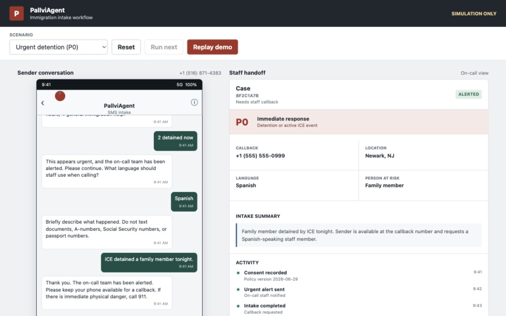

# PallviAgent

SMS-based emergency immigration intake and staff callback router. The Cloudflare Worker in `worker/` is the production deployment target; the Flask service remains available for local development and fallback testing.

The app is designed for intake and staff callback routing only. It should not provide legal advice by SMS.

## Local run

```bash
python3 -m venv .venv
.venv/bin/pip install -r requirements.txt
.venv/bin/python server.py
```

## Test

```bash
.venv/bin/python -m unittest discover -s tests
```

## Key routes

- `/sms` - Twilio webhook
- `/simulate` - local testing endpoint
- `/conversations` - list saved conversations
- `/conversations/<phone>` - full conversation detail

## Intake flow

The conversation collects:

- Consent to continue by SMS
- Language selection: `1` for English or `2` for Spanish
- Full name
- Callback phone
- Whether the caller, family, friend, client, or another person needs help
- Current city/state
- Urgency category
- Brief facts

The production Worker requires `START` followed by `YES`, asks the user to choose English or Spanish, and localizes the remaining intake. It sends one compact alert as soon as a P0/P1 urgency answer is received, sends a compact completion alert for P2 cases, and retries failed staff alerts. It intentionally does not request documents or government identification numbers over SMS.

Optional Cloudflare Workers AI triage reviews only ambiguous free-text urgency answers. It never receives identity or contact fields, cannot lower deterministic priority, and falls back cleanly when unavailable.

Optional on-call acknowledgment adds a short case code to staff alerts. Authorized staff can reply `ACK <case-code>`; unacknowledged P0/P1 alerts can escalate to a separately configured backup number after a bounded timeout. This remains disabled by default.

Completed intakes are classified:

- `P0` - ICE present now, detained now, or equivalent emergency
- `P1` - hearing, removal, or deadline within roughly 72 hours
- `P2` - general urgent intake

## Policy pages

This repo includes:

- `privacy-policy.html`
- `terms.html`

These can be published via GitHub Pages for Twilio A2P registration.

Expected GitHub Pages URLs after Pages is enabled:

- `https://rverma7734.github.io/PallviAgent/privacy-policy.html`
- `https://rverma7734.github.io/PallviAgent/terms.html`

## Twilio webhook

Set the incoming message webhook to:

```text
https://YOUR-DOMAIN/sms
```

The route returns TwiML with a `<Message>` response.

For production, set:

```text
VALIDATE_TWILIO_SIGNATURE=true
PUBLIC_BASE_URL=https://YOUR-DOMAIN
```

This enables Twilio request signature validation for `/sms`.

## Deployment

See `DEPLOYMENT.md` for Render deployment and Twilio webhook setup.

For the lower-cost Cloudflare Workers deployment path, see `CLOUDFLARE_DEPLOYMENT.md`.

The Flask-only `/simulate` route is disabled unless `ENABLE_SIMULATOR=true`. Its conversation inspection routes require `Authorization: Bearer $ADMIN_API_TOKEN` and remain unavailable when no admin token is configured.

## Workflow preview

Open `preview.html` in a browser to review the sender conversation and staff handoff with fake data. The preview is standalone and never sends messages or writes intake records.


